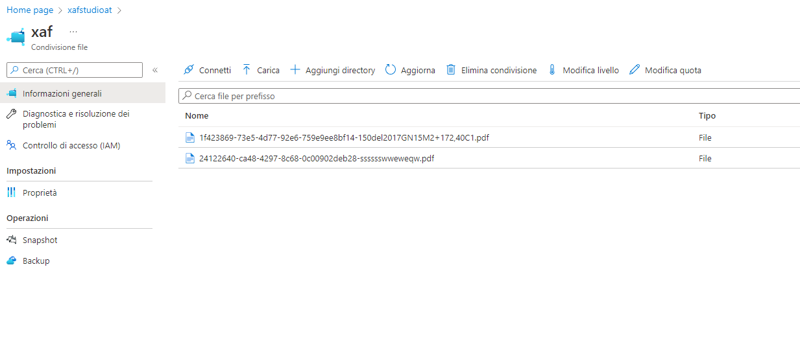
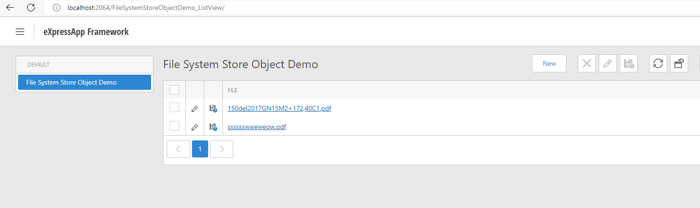

# How to: Store file attachments in the azure file instead of the database (XPO)

- Add in agnostic module AzureFileDataModule

```csharp
/// <summary> 
/// Required method for Designer support - do not modify 
/// the contents of this method with the code editor.
/// </summary>
private void InitializeComponent() {
    // 
    // AzureFileStoreXAFModule
    // 
    this.AdditionalExportedTypes.Add(typeof(DevExpress.Persistent.BaseImpl.BaseObject));
    this.AdditionalExportedTypes.Add(typeof(DevExpress.Persistent.BaseImpl.FileData));
    this.AdditionalExportedTypes.Add(typeof(DevExpress.Persistent.BaseImpl.FileAttachmentBase));
    this.RequiredModuleTypes.Add(typeof(DevExpress.ExpressApp.SystemModule.SystemModule));
    this.RequiredModuleTypes.Add(typeof(DevExpress.ExpressApp.Objects.BusinessClassLibraryCustomizationModule));
    this.RequiredModuleTypes.Add(typeof(AzureFileData.AzureFileDataModule));

}
```


- Create a property in your BO

```csharp
    [DefaultClassOptions]
    [FileAttachment("File")]
    public class FileSystemStoreObjectDemo : BaseObject
    {
        public FileSystemStoreObjectDemo(Session session) : base(session) { }
        [Aggregated, ExpandObjectMembers(ExpandObjectMembers.Never), ImmediatePostData]
        public AzureFileStoreObject File
        {
            get { return GetPropertyValue<AzureFileStoreObject>("File"); }
            set { SetPropertyValue<AzureFileStoreObject>("File", value); }
        }
    }
```


- Set in web.config the name of share folder in azure and [connectionstring azure](https://docs.microsoft.com/it-it/azure/storage/files/storage-how-to-create-file-share?tabs=azure-portal) 
 


```xml
<!--set share folder-->
<add key="ShareName" value="" />

<!--azure connection string -->
<add key="ConnectionString" value="" />
```

- Set parameter in start code (event login ect)
```csharp
AzureFileData.AzureFileDataModule.AzureFileConnectionString = ConfigurationManager.AppSettings["ConnectionString"];
AzureFileData.AzureFileDataModule.AzureFileShareLocation = ConfigurationManager.AppSettings["ShareName"];
```

You can upload file > 4Mb but you must set in web.config
```xml

<system.web>
    <!--Example 60 MB in bytes-->
	<httpRuntime requestValidationMode="2.0" maxRequestLength="61440" />
		
.....

...
        <security>
		<requestFiltering>
			<!--The default size is 30000000 bytes (28.6 MB). MaxValue is 4294967295 bytes (4 GB)-->
			<!-- Example 60 MB in bytes -->
			<requestLimits maxAllowedContentLength="61440000" />
		</requestFiltering>
	</security>
</system.webServer>
```





**Developed using only XAF (web) .NET Framework.**


**Extra info**

You can also use SMB Azure file share so you can use this project [XAF How to store file attachments in the file system instead of the database](https://github.com/DevExpress-Examples/XAF_how-to-store-file-attachments-in-the-file-system-instead-of-the-database-xpo-e965)

Azure Files offers fully managed file shares in the cloud that are accessible via the industry standard Server Message Block (SMB) protocol.
- Sign in to the Azure portal.
- Navigate to the storage account that contains the file share you'd like to mount.
- Select File shares.
- Select the file share you'd like to mount.
- Select Connect.
- Select the drive letter to mount the share to.
- Copy the provided script.


